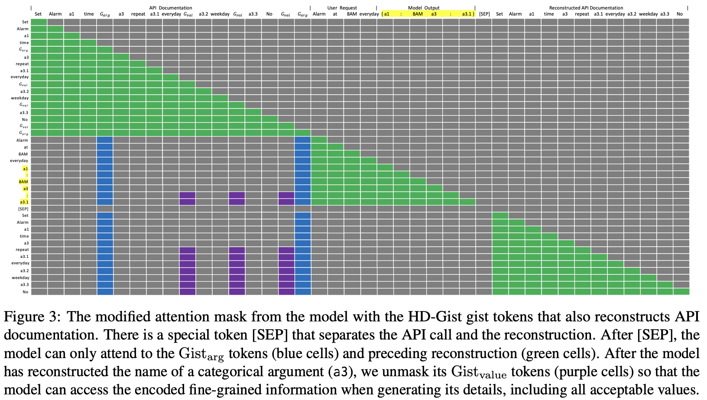

# HD-Gist: Hierarchical and Dynamic Prompt Compression for Efficient Zero-shot API Usage
<hr>

This repository contains code and data for EACL 2024 Findings paper [Hierarchical and Dynamic Prompt Compression for Efficient Zero-shot API Usage]()
by [Yichen Jiang](https://www.jiang-yichen.io/), Marco Del Vecchio, [Mohit Bansal](https://www.cs.unc.edu/~mbansal/), and [Anders Johannsen](http://www.johannsen.com/).


## 0 Setup
### 0.0 Dependency
This codebase is adapted from the orignal [gist-token](https://github.com/jayelm/gisting) paper. We list their recommended setup below:

- This codebase has been tested with python 3.9.16 and pytorch 2.0.0. I recommend creating a new virtual env (e.g. with Conda), then installing torch manually from `pytorch.org`. `pip install -r requirements.txt` should take care of the remaining dependencies.

- Of note is that this codebase requires a quite recent version of Transformers that has support for LLaMA. The specific commit pinned in `requirements.txt` is the one that was tested; any Transformers release newer than that should work (there may be some naming issues with a newer version).
- Some issues that may occur are discussed at the end of this document.

### 0.1 Setup local directories

- Experiment runs and model checkpoints are saved to `exp/` directory
in root directory. 
  - You can change it in `src/conf/config.yaml`, training.output_dir.

- Cached models (downloaded from the Huggingface Hub) and
datasets are saved to `.cache/`. Be sure to create these directories before
running for the first time. 
  - You can change it in `src/conf/config.yaml`, model.cache_dir.

- LLaMA-7B experiments expect a folder called `llama-7b` in the root directory
with model weights and tokenizer. You can manually set the model path of the LLaMA model
from `src/conf/mode/llama-7b.yaml`.

- Training logs are saved via wandb. Set your `wandb` entity name correctly in `src/conf/config.yaml`.

### 0.2 Setup and preprocess data 
In this work, we use the SGD and SGD-X [datasets](https://github.com/google-research-datasets/dstc8-schema-guided-dialogue)
for training and evaluating our models.
- Download the datasets by cloning the entire [repo](https://github.com/google-research-datasets/dstc8-schema-guided-dialogue)
and put it under `./data/raw_data`.
- Run the data preprocessing script to convert the raw data to d3st format for training HD-Gist.
For more details about the datasets and formats, refer to the data [README](data/README.md):
```
cd data/raw_data/;
git clone https://github.com/google-research-datasets/dstc8-schema-guided-dialogue.git;
python3 -m sgd_x.generate_sgdx_dialogues;
cd ../..;
python convert_d3st_format.py \
--dataset_name=sgd \
--add_prompt=v1 \
--use_index \
--json_instruction;
python convert_d3st_format.py \
--dataset_name=sgd_x \
--add_prompt=v1 \
--use_index \
--json_instruction
```
- To also process the data that can run the Gist baseline/LLaMA baseline with reconstruction,
run
```
python convert_d3st_format.py \
--dataset_name=sgd \
--add_prompt=v1 \
--use_index;
python convert_d3st_format.py \
--dataset_name=sgd_x \
--add_prompt=v1 \
--use_index
```


## 1 Training

> **Warning**: Training and decoding HD-Gist model is currently only supported for `batch_size = 1`. For LLaMA-7B, 
> larger batch sizes will require modifying the rotary position embedings to account for gist offsets [here](https://github.com/jiangycTarheel/HD-Gist-dev/blob/main/src/gist_llama.py#L115-L125)
> and other functions that create the gist masks [here](https://github.com/jiangycTarheel/HD-Gist-dev/blob/main/src/data/gist.py#L260).

### 1.0 Debugging locally
If you'd like to train an HD-Gist models, the command

```
./train_scripts/debug_hd_gist_llama_small_sgd.sh
```

trains a small llama-style model on the SGD training dataset.
- The model is randomly initialized, 
- It has 2 layers, 32 heads, 1024 intermediate size and 4096 hidden size)
- It has static **slot-gist** tokens, **dynamic value-gist** tokens
and reconstruction of API from these HD-Gist tokens, while logging to wandb.

- You can disable dynamic value-gist token by setting `training.gist.add_ctg_val_gist_token=False`.
- You can disable reconstruction of API from HD-Gist tokens, by setting `training.gist.inbatch_reconstruct_ratio=0`.

[//]: # (- For debugging, you may be interested in setting the `+experiment=debug` flag, which runs a small model &#40;FLAN-T5-small&#41; on a tiny number of samples and evaluations, just to check that the train/eval loop is working.)

> **Note**: If you're not familiar with the CLI syntax, check out [Hydra](https://hydra.cc/).

### 1.1 Finetuning a LLaMa 7B model with HD-Gist
To finetune the larger models in the paper (LLaMA-7B), multi-gpu
training is required with DeepSpeed. The experiments below all assume a machine with 4 A100 80GB GPUs or 8 A100 40GB GPUs,
and at least 400GB of CPU RAM. 
Other machine configurations will necessitate changing the batch
size and/or deepspeed config setting. 

To finetune a LLaMA-7b with HD-Gist tokens and reconstruction of API documentation from HD-Gist tokens,
for 1 epoch, you can run 

```./train_deepspeed_scripts/train_hd_gist_llama7b_sgd.sh```

- This trains `llama-7b` with the same HD-Gist configuration as the
smaller llama-debug command above, using the hyperparameters in the paper. See
`src/conf/{llama-7b}.yaml` for the hyperparameter configurations.

[//]: # (Take a look at other model configs in `src/conf/model`. In particular there's a)

[//]: # (`llama-debug.yaml` file which trains a small randomly initialized LLaMA model)

[//]: # (for debugging.)

### 1.2 Logging

- Be sure to set your `wandb` entity name correctly in `src/conf/config.yaml`.

- By default this logs an experiment to wandb under a group name that begins with `wandb.tag` (i.e. in the example above, `yourgroupname`); check out `src/conf/config.yaml` to see the full group name. 
Metrics are also logged to stdout.

### 1.3 Saved Checkpoints

- The wandb group and run names also define a directory which will save model checkpoints and outputs locally. 
- By default it is saved at `exp/{wandb.group}/{wandb.run}`. 

## 2 Evaluation

To evaluate the trained HD-Gist model, you can run
```angular2html
./eval_deepspeed_scripts/eval_hd_gist_llama7b_sgd.sh
```
This will decode the HD-Gist model on SGD validation set.

- To decode on SGD-X/v5 validation set, set `data.config_name=x5_d3st_prompt+date_jsonInstruct`.
- To decode on test sets, set `--training.eval_on_test=true`.

## License

The SGD and SGD-X data is licensed "Creative Commons Attribution Share Alike 4.0 International". 
By training and evaluating on the data, you inherit both licenses.

## Known Setup Issues:

> **Issue 1**: PydanticUserError: If you use `@root_validator` with pre=False (the default) you MUST specify `skip_on_failure=True`
- Solution from [StackOverflow](https://stackoverflow.com/questions/76934579/pydanticusererror-if-you-use-root-validator-with-pre-false-the-default-you).

> **Issue 2**: NotImplementedError: Loading a dataset cached in a LocalFileSystem is not supported.
- Solution from [StackOverflow](https://stackoverflow.com/questions/77433096/notimplementederror-loading-a-dataset-cached-in-a-localfilesystem-is-not-suppor)
downgrades fsspec from 2023.10.0 to 2023.9.2.

> **Issue 3**: "zsh: illegal hardware instruction" when running model training.
"
- Solution from [StackOverflow](https://stackoverflow.com/questions/65383338/zsh-illegal-hardware-instruction-python-when-installing-tensorflow-on-macbook).

## Citation

If you found this work useful, please cite

```bibtex
@inproceedings{jiang2024hdgist,
    title={Hierarchical and Dynamic Prompt Compression for Efficient Zero-shot API Usage}, 
    author={Yichen Jiang and Marco Del Vecchio and Mohit Bansal and Anders Johannsen},
    year={2024},
    booktitle={Findings of EACL},
}
```
